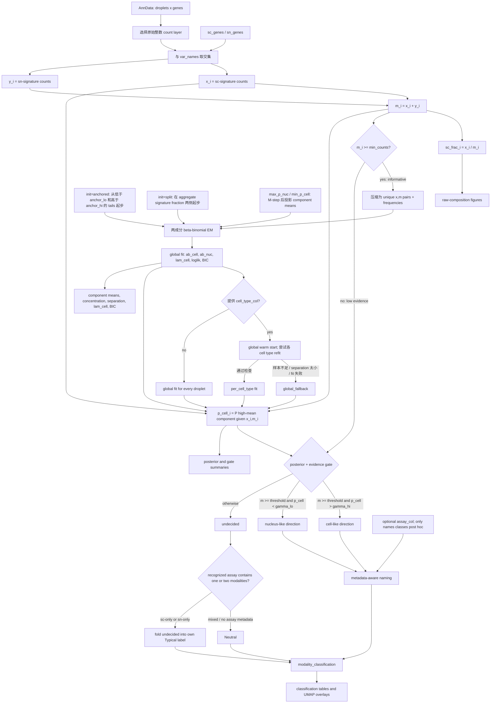

# Source reading: `CellorNuc` and `CellorNucEM`

This note follows `scanpyplus/Scanpyplus.py` lines 1351-1841. The quiz uses
`CellorNucEM`, but the older `CellorNuc` function is useful as a contrast.

## 1. Mental model

The EM classifier reduces every droplet to counts from two short gene sets:

```text
AnnData raw counts
    |
    +-- x = sum of counts for sc-enriched genes
    +-- y = sum of counts for sn-enriched genes
    |
    +-- m = x + y                 evidence carried by the signatures
    +-- sc_frac = x / m           observed cell-like fraction
    |
    +-- fit two beta-binomial components to (x, m)
            |
            +-- high-mean component = cell-like
            +-- low-mean component  = nucleus-like
            |
            +-- p_cell = posterior probability of high-mean component
                    |
                    +-- threshold p_cell
                    +-- combine with optional assay metadata to name the class
```

The method is therefore a classifier of **cell-like versus nucleus-like
signature composition**. It does not use all genes in the likelihood, and
`modality_counts` is not the droplet's total UMI count: it is the sum across
the sc and sn signature genes only.

## 2. Vocabulary and notation

| Symbol/code name | Meaning |
|---|---|
| `sc_genes` | Genes whose expression is enriched in intact-cell data. |
| `sn_genes` | Genes whose expression is enriched in nucleus data. |
| `x` | Per-droplet sum over the sc signature genes. |
| `y` | Per-droplet sum over the sn signature genes. |
| `m = x + y` | Total signature evidence for that droplet. |
| `sc_frac = x / m` | Observed fraction of signature counts coming from sc genes. |
| `(a, b)` or `ab` | Shape parameters of a fitted beta distribution. |
| `p = a / (a + b)` | Mean sc fraction of one component. |
| `lam_cell` | Estimated fraction of observations in the cell-like component. |
| `gamma` / `p_cell` | Posterior probability that a droplet belongs to the cell-like component. |
| `enough` | Whether `m >= min_counts`; only these droplets fit or receive evidence-based labels. |

`sc` and `sn` describe the known assay/source modality. “Cell-like” and
“nucleus-like” describe what the signature model sees. That is why a label such
as `Nucleus-like Cell (SC)` is meaningful: the metadata says the droplet came
from an sc assay, while the fitted signature component looks nuclear.

## 3. Gene signatures and `LoadGeneSignatures()` (lines 1351-1391)

### `gene_signatures.json`

The JSON file currently has one signature set, `hcka_v1`, containing ten
sc-enriched and ten sn-enriched genes. It also stores provenance rather than
only gene names:

- the signatures were derived from Human Kidney Cell Atlas sc and sn objects;
- mitochondrial and ribosomal genes were excluded during feature selection;
- several feature-ranking/statistical signals were cross-referenced;
- the set is marked `provisional - pre statistical validation`.

That last point is important scientifically: the JSON records a useful trained
signature, not a universal biological law. The quiz's independent-data check
is therefore a validation exercise.

Lines 1351-1352 also define module-level `sc_genes` and `sn_genes` lists that
duplicate the current JSON values. `LoadGeneSignatures()` does not read those
variables; it reads the JSON file.

### Loader, block by block

- **1354-1378:** The signature name defaults to `hcka_v1`. Passing
  `signature=None` requests the entire metadata dictionary instead of a pair of
  gene lists. `path` can point to a different signature file.
- **1379-1382:** If no path is supplied, it builds a path relative to
  `Scanpyplus.py` itself. This makes loading independent of the current working
  directory.
- **1383-1384:** Standard `json.load` converts the file into nested Python
  dictionaries/lists.
- **1385-1386:** `signature=None` returns everything, including provenance.
- **1387-1389:** An unknown signature name raises a helpful error listing the
  available keys.
- **1390-1391:** A named signature returns exactly two lists:
  `(sig['sc_genes'], sig['sn_genes'])`.

The ordinary entry point is:

```python
sc_genes, sn_genes = Scanpyplus.LoadGeneSignatures()
```

## 4. Older score-based `CellorNuc` (lines 1393-1503)

This function and `CellorNucEM` are not two names for the same algorithm.

### Inputs and data assumptions (1393-1441)

`CellorNuc` requires:

1. an `AnnData` object;
2. both signature lists;
3. an `obs` cell-type column;
4. an `obs` assay/modality column with recognizable sc and sn labels.

Unlike the EM implementation, it calls `scanpy.tl.score_genes` on the active
matrix. That score is normally interpreted on appropriately normalized
expression data. The function does not select a layer or verify the matrix's
scale.

`copy=False` means mutate the supplied object and return `None`.
`copy=True` means work on and return an independent `AnnData` object.

### Execution (1443-1503)

- **1443:** Apply the copy policy.
- **1445-1449:** Require both requested `obs` columns.
- **1451-1456:** Intersect both signature lists with `adata.var_names`; fail if
  either intersection is empty.
- **1458-1460:** Use Scanpy's gene scoring to create `sc_score` and `sn_score`.
- **1462-1466:** Define `cell_vs_nucleus_score = sc_score - sn_score`, then
  create a percentile-clipped version.
- **1468-1469:** Initialize every label as `Uncertain`.
- **1471-1487:** Within each cell type, use known sc observations to estimate a
  lower sc boundary and known sn observations to estimate an upper sn boundary.
  The boundaries are forced to opposite sides of zero.
- **1489-1497:** Compare each known sc/sn droplet with those boundaries to call
  typical or cross-modality profiles.
- **1499-1503:** Convert labels to a categorical column and obey the copy/return
  policy.

This method is metadata-calibrated: known assay labels participate in estimating
its thresholds. By contrast, `CellorNucEM` fits signature components without
using `assay_col`; that column only changes the final names.

### Two source-level caveats

1. `cell_vs_nucleus_score_clipped` is stored at lines 1465-1466, but lines
   1479-1497 classify with the **unclipped** `cell_vs_nucleus_score`. Thus
   `clip_percentiles` does not affect the calls in this implementation.
2. Lines 1491-1497 assign strings such as `Typical Cell (SC)`, but line 1500's
   categorical levels omit the `(SC)`/`(SN)` suffixes. Pandas converts assigned
   strings that are absent from the declared categories to missing values. This
   should be treated as an implementation inconsistency, not intended biology.

For the starter quiz, the newer EM function is the relevant implementation.

## 5. `_set_counts_EM` (lines 1508-1514)

This helper converts a signature list into one count per droplet.

- **1509:** Keep only genes present in `adata.var_names`. Partial overlap is
  allowed.
- **1510-1511:** Zero overlap is fatal because the corresponding signal cannot
  be measured.
- **1512:** Convert gene names to integer column positions.
- **1513:** Use `adata.layers[layer]` when a layer is named; otherwise use
  `adata.X`.
- **1514:** Subset to the signature columns, sum across genes for each droplet,
  and flatten the result into a one-dimensional NumPy array.

Calling it once on `sc_genes` produces `x`; calling it on `sn_genes` produces
`y`. Because the beta-binomial likelihood is a count model, this is why the
demo emphasizes `layer='counts'`.

## 6. Beta-binomial mathematics (lines 1517-1556)

### What counts as a “trial” and a “success” here?

For droplet `i`:

- `x_i` is its count across sc-enriched signature genes;
- `y_i` is its count across sn-enriched signature genes;
- `m_i = x_i + y_i` is its total signature count;
- an sc-signature count is treated as a “success,” and an sn-signature count as
  a “failure.”

The likelihood is conditional on `m_i`. It models how the fixed amount of
signature evidence divides between the two gene sets; it does not model the
droplet's total transcript count or why `m_i` varies between droplets.

This is a working statistical abstraction. Real UMIs from different genes are
not literally identical independent coin tosses. The beta-binomial summarizes
the observed composition and its extra heterogeneity without trying to model
every gene separately.

### The hierarchical model

A binomial model would assign one fixed sc fraction `p` to every droplet in a
component. Biological and technical heterogeneity make that too restrictive.
The beta-binomial instead gives each droplet a latent fraction `q_i`:

```text
q_i | component k  ~ Beta(a_k, b_k)
x_i | q_i, m_i, k  ~ Binomial(m_i, q_i)
```

Integrating out `q_i` gives:

```text
X_i | (m_i, component k) ~ BetaBinomial(m_i, a_k, b_k)
```

Its probability mass function is

```text
                 choose(m_i, x_i) × B(x_i + a_k, m_i - x_i + b_k)
f_k(x_i | m_i) = --------------------------------------------------
                                  B(a_k, b_k)
```

Here, `B(·,·)` is the beta function. This is what
`scipy.stats.betabinom.logpmf(x, m, a, b)` evaluates in log form.

### Statistical meaning of `a` and `b`

The raw shape parameters are easiest to interpret through two derived values:

```text
p_k     = a_k / (a_k + b_k)     component mean
kappa_k = a_k + b_k             component concentration
```

- `p_k`, the component mean, is the expected sc-signature fraction.
- `kappa_k`, the concentration, controls how tightly droplets cluster around
  that mean.

The latent fraction has

```text
E(q_i | k)   = p_k

                 p_k × (1 - p_k)
Var(q_i | k) = -----------------
                    kappa_k + 1
```

Thus two components can have the same mean but different heterogeneity. A large
`kappa` creates a narrow Beta distribution and approaches an ordinary
binomial; a small `kappa` permits substantial droplet-to-droplet variation.
Neither `a` nor `b` is a number of cells, genes, or observed UMIs. They are
fitted distribution-shape parameters.

For observed counts,

```text
E(X_i | m_i, k) = m_i × p_k

                                      m_i + kappa_k
Var(X_i | m_i, k) = m_i × p_k × (1 - p_k) × ---------------
                                      1 + kappa_k

                  = m_i × p_k × (1 - p_k) × [1 + (m_i - 1) × rho_k]

rho_k = 1 / (kappa_k + 1)
```

The bracketed factor is the extra variance relative to a binomial. This
overdispersion is the main
reason to use beta-binomial rather than binomial.

For the observed ratio `X_i / m_i` when `m_i > 0`:

```text
                       p_k × (1 - p_k) × (m_i + kappa_k)
Var(X_i / m_i | k) = ---------------------------------------
                              m_i × (1 + kappa_k)
```

Small `m_i` therefore makes `sc_frac` noisy. Increasing `m_i` reduces
binomial sampling noise, but the variance does not collapse to zero because the
Beta layer represents persistent between-droplet heterogeneity.

### Code-to-math dictionary

| Code value | Mathematical role | Shape/interpretation |
|---|---|---|
| `x`, `y`, `m` | `x_i`, `y_i`, `m_i` | Length `n_obs` arrays, one value per droplet. |
| `enough` | Indicator that `m_i >= min_counts` | Boolean gate for fitting and confident classification. |
| `pairs[:, 0]`, `xu` | Unique `x_j` values | sc counts for each unique `(x,m)` pattern. |
| `pairs[:, 1]`, `mu` | Unique `m_j` values | Total signature counts for each unique pattern; `mu` does not mean a statistical mean here. |
| `cnt`, `w` | `c_j` or soft weight | Pattern frequency, possibly multiplied by an EM responsibility. |
| `p` in line 1583 | `x_j / m_j` | Raw observed fraction used only to initialize groups. |
| `ab1`, `ab_cell` | `(a_C, b_C)` | Shape parameters for the high-mean/cell-like component. |
| `ab0`, `ab_nuc` | `(a_N, b_N)` | Shape parameters for the low-mean/nucleus-like component. |
| `lam`, `lam_cell` | `lambda = P(Z=C)` | Mixture prevalence/prior probability of the cell-like component. |
| `l1`, `l0` | log joint component scores | Log mixture weight plus log beta-binomial PMF. |
| `norm` | log marginal probability | `logsumexp(l1,l0)` for each unique pattern. |
| `r1` | Probability of `Z_j=C`, given `x_j,m_j` | E-step cell responsibility for each unique pattern. |
| `ll`, `prev_ll` | Log likelihood | Frequency-weighted mixture log likelihood. |
| `gamma`, `p_cell` | Probability of `Z_i=C`, given `x_i,m_i` | Final posterior for every droplet. |

There are three different quantities that may all be informally called “p”:

1. `p = xu/mu` is an observed ratio used during initialization;
2. `p_C = a_C/(a_C+b_C)` and `p_N = a_N/(a_N+b_N)` are component means;
3. `p_cell` is the posterior probability of component membership.

Keeping these distinct is essential when reading the code or answering a
question about “component means p.”

### Weighted maximum likelihood: `_fit_bb_weighted_EM`

For one component, the weighted log likelihood is

```text
weighted log likelihood(a,b) = sum over j of:
                               w_j × log f(x_j | m_j,a,b)
```

When `w=cnt`, this is exactly the ordinary likelihood of all droplets after
identical `(x,m)` observations have been compressed. For example, a unique pair
seen 30 times contributes 30 copies of the same log PMF. During EM, `w` becomes
`cnt*r1` or `cnt*(1-r1)`, producing fractional/soft component membership.

There is no simple closed-form MLE for beta-binomial `a,b`, so lines 1530-1542
minimize the negative weighted log likelihood numerically:

- `log_ab` is optimized and exponentiated, guaranteeing `a,b > 0`;
- `init=(5,5)` is only the optimizer's starting point, not a Bayesian prior;
- invalid PMFs and concentration above `max_conc=1e8` receive a large penalty;
- Nelder-Mead returns fitted shape parameters.

The concentration cap prevents numerical runaway when a component is almost
binomial. As `kappa` tends to infinity, between-droplet heterogeneity vanishes, so very
large concentrations are practically indistinguishable while becoming
numerically unstable.

The optimizer result's success flag is not checked. Fitted means, separation,
BIC, convergence messages, and sensitivity to initialization should therefore
be treated as diagnostics rather than assuming every returned tuple is ideal.

### `_mean_p_EM` and `_constrain_EM`

`_mean_p_EM((a,b))` computes `p = a/(a+b)`.

For concentration `kappa = a+b`, `_constrain_EM` clips the mean to a target
`p_target` and returns:

```text
a_new = p_target × kappa
b_new = (1 - p_target) × kappa
```

This changes the component location while preserving its concentration. It is
a post-M-step projection, not a fresh numerical maximization of the likelihood
subject to the bound. Consequently, with active constraints the procedure is
best understood as projected/constrained EM, and the usual guarantee that an
unconstrained EM likelihood never decreases need not apply to the projection.

`anchor_lo`/`anchor_hi` do not call this function and are not constraints.

## 7. Two-component fit: `_fit_two_comp_EM` (lines 1559-1637)

The mixture has a high-fraction component intended to represent cell-like
profiles and a low-fraction component intended to represent nucleus-like
profiles.

Introduce an unobserved indicator `Z_i`, whose value is `C` (cell-like) or `N`
(nucleus-like):

```text
P(Z_i = C) = lambda
P(Z_i = N) = 1 - lambda
```

Conditional on that indicator, each component has its own beta-binomial shape:

```text
X_i | (m_i, Z_i = C) ~ BetaBinomial(m_i, a_C, b_C)
X_i | (m_i, Z_i = N) ~ BetaBinomial(m_i, a_N, b_N)
```

Because `Z_i` is not observed by the fitting algorithm, the marginal PMF is:

```text
P(X_i = x_i | m_i)
    = lambda × f_C(x_i | m_i) + (1 - lambda) × f_N(x_i | m_i)
```

For compressed patterns `j` with frequencies `c_j`, the quantity optimized
by the code is

```text
mixture log likelihood = sum over j of:

    c_j × log[
        lambda × f_C(x_j | m_j)
        + (1 - lambda) × f_N(x_j | m_j)
    ]
```

The parameter set is `(a_C, b_C, a_N, b_N, lambda)`, making this a
five-parameter mixture.

### Arguments and return value (1559-1581)

- `xu`, `mu`, `cnt`: unique `(x, m)` pairs and their frequencies.
- `init_from`: an existing fit used as a warm start, especially the global fit
  before fitting individual cell types.
- `init`: initialization scheme; documented choices are `anchored` and `split`.
- `anchor_lo`, `anchor_hi`: tails used only by anchored initialization.
- `max_p_nuc`, `min_p_cell`: optional hard bounds applied after EM updates.
- `max_iter`, `tol`: stopping controls.

It returns the two `(a, b)` pairs, `lam_cell`, mixture log likelihood, and BIC
values for one- and two-component models.

### Initialization precedence (1582-1603)

1. **Warm start, 1584-1586:** If `init_from` is supplied, its component
   parameters and mixing weight take precedence over `init`.
2. **Anchored, 1587-1595:** Compute `p=x/m`; initialize the cell component from
   unique pairs above `anchor_hi` and the nucleus component from pairs below
   `anchor_lo`. If a tail has fewer than two unique `(x,m)` pairs, use weak
   fallback shapes `(19,1)` (mean 0.95) or `(1,19)` (mean 0.05). Initialize the
   cell mixture weight from the high-tail observation count, clipped to
   `[0.01, 0.99]`; if there is no high-tail pair at all, it defaults to `0.9`.
3. **Split, 1596-1603:** Split at the evidence-weighted average fraction. Since
   the weights are `cnt * m`, the split equals the aggregate sc-signature count
   divided by aggregate signature count. Fit one component on each side. If
   either side has fewer than two unique pairs, initialization fails.

The source uses a plain `else`, so any `init` value other than the exact string
`"anchored"` follows the split branch. A misspelling is therefore not rejected.

The fallback tuples `(19,1)` and `(1,19)` are sometimes described in the code
comment as “weak priors,” but mathematically they are **initial parameter
values**, not priors used in Bayesian inference. Once EM starts, the optimizer
can move them unless the separate mean constraints are active.

For split initialization, the code's threshold has a useful simplification:

```text
        sum over j of: (c_j × m_j) × (x_j / m_j)
split = ----------------------------------------------------
                  sum over j of: c_j × m_j

        sum over j of: c_j × x_j
      = ---------------------------
        sum over j of: c_j × m_j
```

It is the aggregate fraction of all signature counts assigned to sc genes, not
the unweighted average droplet fraction.

### `anchored` versus `split`

| Property | `init="anchored"` | `init="split"` |
|---|---|---|
| Initial groups | Fixed low and high tails of `sc_frac` | Two sides of the data's weighted mean |
| Default cutoffs | `< 0.3` and `> 0.7` | Dataset-dependent |
| Empty-tail behavior | Uses a weak 0.05/0.95 fallback component | Raises if a side has too few unique pairs |
| Intended advantage | Keeps initial components at biologically distinct ends under imbalance | Lets both starts be determined by the observed distribution |
| Main risk | Tail thresholds may not match a shifted dataset | In single-modality data, the mean may cut the dominant peak into two pieces |

Both are only starting strategies. Ordinary EM can move the component means
away from their starts. To keep them within fixed biological ranges throughout
fitting, use `max_p_nuc` and/or `min_p_cell`.

Mixture likelihoods are generally non-convex and can have local optima. Two
initializations can therefore converge to different parameter sets even though
they use exactly the same observations and likelihood. This sensitivity is
most relevant when components overlap strongly, one component is rare, or the
data are effectively single-modality.

### EM iterations (1605-1625)

Each loop alternates between two steps:

**E-step (1607-1612)**

Given current parameters, the responsibility of the cell-like component is:

```text
cell_score    = lambda × f_C(x_j | m_j)
nucleus_score = (1 - lambda) × f_N(x_j | m_j)

r_j = cell_score / (cell_score + nucleus_score)
```

The code first constructs:

```text
l1 = log(lambda)     + log f_C(x_j | m_j)
l0 = log(1 - lambda) + log f_N(x_j | m_j)
```

as `l1` and `l0`. `logsumexp([l1,l0])` is the stable log denominator. Then
`r1 = exp(l1 - norm)`. `ll = sum(cnt*norm)` is the observed-data mixture log
likelihood, not the complete-data likelihood.

`r1` is a temporary posterior for each **unique pattern** under the current
iteration's parameters. After convergence, `_posterior_cell_EM` applies the
same formula to every original droplet and stores it as `gamma`/`p_cell`.
Droplets with identical `(x,m)` and the same fit necessarily receive identical
posteriors.

**M-step (1615-1625)**

The mixture weight has the closed-form update:

```text
             sum over j of: c_j × r_j
lambda_new = -------------------------
             sum over j of: c_j
```

This is why `lam_cell` can be interpreted as the fitted cell-component
prevalence: it is the mean soft assignment, not necessarily the fraction of
droplets that pass the final `gamma_hi` threshold.

The shape updates maximize the expected component-specific log likelihoods:

```text
(a_C, b_C)_new = the (a,b) values maximizing:
                 sum over j of c_j × r_j × log f(x_j | m_j,a,b)

(a_N, b_N)_new = the (a,b) values maximizing:
                 sum over j of c_j × (1-r_j) × log f(x_j | m_j,a,b)
```

These have no closed-form solution, so each M-step calls the numerical weighted
beta-binomial fitter. The previous shapes are passed as its next starting point.
Afterward, optional mean bounds project the updated shapes as described above.

The loop stops only after at least four iterations when the log-likelihood
improvement is smaller than `tol*abs(ll)`. A negative improvement also satisfies
that test. Moreover, if the condition fires, the returned `prev_ll` is the
previous accepted value rather than the just-computed `ll`; normally the
difference is tiny, but it is worth knowing when auditing convergence.

### Component identity and BIC (1627-1637)

- **1627-1628:** If necessary, swap components so `ab_cell` is always the
  higher-mean one. “Cell” is therefore defined operationally as the component
  with more sc-signature composition.
- **1630-1632:** Fit a single beta-binomial component to the same data.
- **1633-1637:** Store both models' BIC values. The one-component model counts
  two parameters (`a,b`); the mixture counts five (`a,b` twice plus `lam`).
  Lower BIC is preferred. `bic_2 < bic_1` is evidence that two components fit
  better after penalizing complexity, not proof that they are two biological
  modalities.

The exact formulas in the return dictionary are:

```text
BIC_1 = -2 × loglik_1 + 2 × log(n)
BIC_2 = -2 × loglik_2 + 5 × log(n)
```

Here, `n = sum(cnt)` is the number of informative droplets, not the number of
unique pairs and not their total signature counts. A useful comparison is
`delta_BIC = BIC_1 - BIC_2`: positive values favor the two-component fit, while
negative values favor one component. The code uses only the sign and emits a
warning when `BIC_2 >= BIC_1`.

Mixture models have nonstandard boundary behavior, especially when a component
weight approaches zero or two components coincide. BIC is best used here as a
diagnostic alongside component separation, stability across initializations,
and biological plausibility.

### Identifiability in single-modality data

A two-component model can mathematically divide one broad or skewed population
into two fitted components even when there are not two biological modalities.
In that setting:

- `split` may divide the main peak at its weighted center;
- `anchored` supplies starts at opposite tails but cannot create evidence that
  is absent from the likelihood;
- `max_p_nuc` and `min_p_cell` encode external structural assumptions;
- BIC, fitted separation, component prevalence, and initialization sensitivity
  help reveal whether the minority component is well supported.

The high-mean/low-mean names resolve statistical label switching, but they do
not by themselves establish the biological identity of two components.

## 8. `_posterior_cell_EM` (lines 1640-1645)

This helper applies Bayes' rule to each `(x,m)` observation:

```text
cell_score    = lam_cell × BB(x | m, ab_cell)
nucleus_score = (1 - lam_cell) × BB(x | m, ab_nuc)

p_cell = cell_score / (cell_score + nucleus_score)
```

It performs the calculation in log space for numerical stability.

The same relationship is especially interpretable on the log-odds scale:

```text
posterior log odds = prevalence log odds + data log-likelihood ratio

log[p_cell_i / (1 - p_cell_i)]
    = log[lambda / (1 - lambda)]
      + log[f_C(x_i | m_i) / f_N(x_i | m_i)]
```

The posterior log odds equal **prior/prevalence log odds** plus a **data log
likelihood ratio**. Consequently:

- `lam_cell` shifts every posterior toward the more prevalent fitted component;
- the relative component PMFs measure how compatible the droplet is with each
  component;
- `m` affects how much evidence the observed ratio carries.

This explains why `p_cell` is not interchangeable with `sc_frac`:

- `sc_frac` is just the observed ratio `x/m`;
- `p_cell` also accounts for the fitted component locations and dispersions,
  the number of signature counts `m`, and the fitted component prevalence
  `lam_cell`.

Two droplets with the same `sc_frac` but different `m` can therefore have
different certainty.

For a purely hypothetical illustration, suppose the fitted cell component is
`Beta(8,2)`, the nucleus component is `Beta(2,8)`, and `lam_cell=0.7`. The
following observations all have `sc_frac=0.8`, but their posteriors differ:

| `x` | `m` | `sc_frac` | Approximate `p_cell` |
|---:|---:|---:|---:|
| 4 | 5 | 0.8 | 0.9747 |
| 8 | 10 | 0.8 | 0.9929 |
| 40 | 50 | 0.8 | 0.9995 |

The ratio points in the same direction each time, while more observations make
the likelihood ratio more decisive for these particular component parameters.
This example is explanatory only and is not calculated from either quiz file.

At the extreme `m=0, x=0`, both beta-binomial PMFs equal 1, so the posterior is
just `lam_cell`: there is no droplet-specific signature evidence. The
`enough` gate prevents such a posterior from becoming an evidence-based label.
For `0 < m < min_counts`, the model can still compute a posterior, but the
classification gate treats the evidence as insufficient.

`p_cell=0.9` should be read as “90% posterior membership in the fitted
high-sc-fraction component under this model and its estimated parameters.” It
is not automatically a 90% externally calibrated probability that the droplet
is biologically an intact cell, nor is it a frequentist confidence interval.
That interpretation requires the component-to-biology mapping and model to be
credible on the dataset at hand.

## 9. Main API: `CellorNucEM` (lines 1648-1841)

### Signature and parameters (1648-1675)

| Parameter | Role |
|---|---|
| `adata` | Input `AnnData`; observations are droplets and variables are genes. |
| `sc_genes`, `sn_genes` | Signature lists, usually returned by `LoadGeneSignatures`. |
| `assay_col` | Optional metadata used **only after fitting** to name typical/anomalous classes. |
| `cell_type_col` | Optional metadata for separate within-cell-type refits. |
| `sc_label`, `sn_label` | Exact values in `assay_col` that mean sc and sn. |
| `layer` | Raw-count layer; `None` uses `adata.X`. |
| `min_counts=10` | Minimum signature count `m`, not minimum whole-transcriptome UMI count. |
| `gamma_hi`, `gamma_lo` | Posterior thresholds for confident cell-like and nucleus-like calls. |
| `min_cells_fit` | Minimum informative observations needed before trying a cell-type-specific fit. |
| `min_separation` | Minimum difference between fitted component means for accepting a cell-type fit. It is not applied to the global fit. |
| `init`, `anchor_lo`, `anchor_hi` | Global initialization behavior. |
| `max_p_nuc`, `min_p_cell` | Optional constraints on fitted component means. |
| `verbose` | Print every EM iteration. |
| `print_mode` | Print summaries and plot UMAP if one exists; it does not change fitted results. |
| `copy` | Return a modified copy if true; otherwise mutate input and return `None`. |

### Docstring outputs (1676-1704)

The function writes five columns to `adata.obs` and a fit dictionary to
`adata.uns['modality_em']`. With an `assay_col`, the labels describe agreement
or disagreement between assay origin and fitted component. Without it, the
labels are simply `Cell-like`, `Nucleus-like`, or `Neutral`.

The docstring also describes optional console summaries and UMAP plotting. A
missing UMAP does not prevent fitting.

### Validate thresholds and honor `copy` (1705-1711)

The only explicit ordering validation is
`0 <= gamma_lo < gamma_hi <= 1`. Strict separation prevents overlapping label
rules. The code does not similarly validate the anchor order, constraint order,
or `init` spelling.

### Build count evidence (1713-1723)

1. Sum raw sc-signature counts into `x` and sn-signature counts into `y`.
2. Warn if either contains non-integers, because that often means normalized or
   log-transformed input was supplied.
3. Round and cast both arrays to integers even after warning.
4. Compute `m=x+y` and `enough = (m >= min_counts)`.

Only `enough` observations fit the mixture and qualify for evidence-based final
labels. The function still computes posteriors for the other observations.

### Compress and fit globally (1725-1741)

- `uniq(mask)` compresses repeated `(x,m)` pairs into one row plus a frequency.
  This is computationally equivalent to fitting every repeated droplet but is
  much faster.
- Fewer than ten distinct informative pairs is an error.
- The selected initialization and constraints are passed to the global fit.
- If the one-component BIC is no worse than the two-component BIC, the function
  warns that the data may contain one modality. It intentionally continues and
  reports posteriors, so the user must inspect the fitted means and BIC.

### Optional cell-type refitting (1743-1779)

The global fit is always created first.

If `cell_type_col` is supplied, each cell type is handled as follows:

1. Require at least `min_cells_fit` informative observations.
2. Fit its unique `(x,m)` pairs, warm-starting from the global parameters.
3. Accept the local fit only if
   `mean(ab_cell) - mean(ab_nuc) >= min_separation`.
4. On too few observations, fitting failure, or insufficient separation, emit
   a warning and use the global fit.
5. Compute posteriors for all droplets in that cell type and tag them as
   `per_cell_type` or `global_fallback`.

Without `cell_type_col`, every posterior uses the global fit and
`modality_fit='global'`.

One subtlety: because local fits receive `init_from=fit_global`, the warm-start
branch takes precedence over a fresh anchored/split partition inside each cell
type. The chosen global initialization can still influence the local fit via
that starting point.

This is not a hierarchical or partially pooled statistical model. Each accepted
cell-type fit is optimized independently after the warm start. The global fit
provides initialization and an all-or-nothing fallback, but no penalty
continuously shrinks local parameters toward global parameters.

### Posterior thresholding (1781-1784)

```python
cell_p = gamma > gamma_hi
nuc_p  = gamma < gamma_lo
```

The comparisons are strict. Equality with a threshold remains undecided. Labels
start as `Neutral`, and subsequent rules overwrite only confident, informative
observations.

### Classification with assay metadata (1786-1819)

For recognized assay values, the mapping is:

| Known assay | Posterior condition | Final label |
|---|---|---|
| sc | `enough` and `p_cell > gamma_hi` | `Typical Cell (SC)` |
| sc | `enough` and `p_cell < gamma_lo` | `Nucleus-like Cell (SC)` |
| sn | `enough` and `p_cell < gamma_lo` | `Typical Nucleus (SN)` |
| sn | `enough` and `p_cell > gamma_hi` | `Cell-like Nucleus (SN)` |
| either in mixed data | insufficient evidence or middle posterior | `Neutral` |

If the recognized metadata contains only sc or only sn observations, lines
1799-1817 replace undecided labels belonging to that modality with its typical
label. Consequently, in recognized sc-only data, the anomalous label requires
a confident low posterior and enough counts; middle-posterior and low-count
droplets are folded into `Typical Cell (SC)`. The mirror rule applies to sn-only
data.

Values in `assay_col` that match neither `sc_label` nor `sn_label` remain
`Neutral`; line 1818 preserves that category if needed.

### Classification without assay metadata (1820-1823)

Confident informative droplets become `Cell-like` or `Nucleus-like`.
Everything else remains `Neutral`. There is no typical/anomalous interpretation
because no known assay identity was provided.

### Stored outputs and reporting (1825-1841)

| Location | Output | Interpretation |
|---|---|---|
| `obs['modality_counts']` | `m=x+y` | Amount of signature evidence. |
| `obs['sc_frac']` | `x/m`, or `NaN` when `m=0` | Raw cell-signature fraction. |
| `obs['p_cell']` | `gamma` | Model posterior for the high-mean component. |
| `obs['modality_fit']` | fit tag | Global, local, or fallback fit used. |
| `obs['modality_classification']` | categorical label | Thresholded result, optionally named using assay metadata. |
| `uns['modality_em']['global']` | fit dictionary | Global parameters, mixture weight, likelihood, and BIC. |
| `uns['modality_em'][cell_type]` | fit dictionary and tag | Present when per-cell-type fitting is requested. |

### How to interpret a stored fit

The raw dictionary is most readable after converting each `(a,b)` pair to mean,
concentration, and overdispersion correlation:

```python
fit = adata.uns["modality_em"]["global"]

a_cell, b_cell = fit["ab_cell"]
a_nuc, b_nuc = fit["ab_nuc"]

p_cell_component = a_cell / (a_cell + b_cell)
p_nuc_component = a_nuc / (a_nuc + b_nuc)

kappa_cell = a_cell + b_cell
kappa_nuc = a_nuc + b_nuc

rho_cell = 1 / (kappa_cell + 1)
rho_nuc = 1 / (kappa_nuc + 1)

separation = p_cell_component - p_nuc_component
delta_bic = fit["bic_1"] - fit["bic_2"]
```

Interpret the derived values as follows:

| Derived value | Statistical meaning |
|---|---|
| `p_cell_component` | Center of the fitted high-sc-fraction population. |
| `p_nuc_component` | Center of the fitted low-sc-fraction population. |
| `kappa_cell`, `kappa_nuc` | Within-component concentration; larger means less latent heterogeneity. |
| `rho_cell`, `rho_nuc` | Beta-binomial intra-class correlation/overdispersion; larger means more extra-binomial variation. |
| `separation` | Distance between component means on the sc-fraction scale. |
| `lam_cell` | Fitted prevalence of the high-mean component among informative observations. |
| `delta_bic` | Positive favors two components over one under the code's BIC calculation. |
| `loglik` | Maximized/last accepted two-component mixture log likelihood; useful mainly for comparing fits to the same data. |

Do not confuse `p_cell_component` with the per-droplet column `obs['p_cell']`.
The former is one location parameter for the entire component; the latter is a
different posterior probability for every droplet.

With `print_mode=True`, the function prints label counts, an assay-by-label
crosstab, and a classification UMAP when `adata.obsm['X_umap']` exists. It only
warns when the embedding is absent.

Finally, line 1841 follows the same mutation convention as the old function:

```python
result = Scanpyplus.CellorNucEM(..., copy=True)   # result is AnnData
Scanpyplus.CellorNucEM(adata, ..., copy=False)    # adata changes; return is None
```

## 10. Input contract for the supplied quiz files

Read-only schema inspection of the 6k files gives:

| Dataset | Shape | Signature overlap (sc/sn) | Count storage | Relevant metadata |
|---|---:|---:|---|---|
| mixed dataset A | 6,000 x 29,987 | 10/9 | integer `X` and integer `layers['counts']` | `suspension_type` contains `cell` and `nucleus`; `cell_type` is available |
| single-modality dataset B | 6,000 x 28,562 | 10/10 | integer `X` and integer `layers['counts']` | no pre-existing sc/sn modality column |

This has two API consequences:

1. `layer='counts'` is an explicit, readable way to satisfy the likelihood's
   raw-count assumption.
2. If dataset A's `suspension_type` is used as `assay_col`, its exact label
   values must be supplied as `sc_label='cell'` and `sn_label='nucleus'`.
   Dataset B can be run without `assay_col` for generic labels, or a known sc
   metadata column can be added as demonstrated in the official notebook when
   SC-specific label names are desired.

The `assay` column in dataset A records sequencing technologies (`10x 5' v1`
and `10x multiome`), not the exact default strings `sc` and `sn`; column meaning
matters more than the column name.

The mixed 6k file lacks one provisional sn gene, `AC098829.1`. This is allowed:
`_set_counts_EM` uses the nine sn genes that are present. The overlap count is a
useful item to record because a different gene index or annotation can change
how much of a supplied signature is measurable.

## 11. A disciplined reading/debugging checklist

Before interpreting any run, verify:

1. Both signature lists overlap `adata.var_names` and note how many genes were
   found; `_set_counts_EM` silently allows partial overlap.
2. The selected matrix/layer contains raw integer counts.
3. `assay_col`, `sc_label`, and `sn_label` agree exactly if metadata-aware names
   are requested.
4. How many droplets satisfy `modality_counts >= min_counts`.
5. The global component means
   `a_cell/(a_cell+b_cell)` and `a_nuc/(a_nuc+b_nuc)`.
6. Whether `bic_2 < bic_1`, while remembering this is model-selection evidence,
   not biological ground truth.
7. Whether a cell-type result used a local fit or `global_fallback`.
8. Whether a reported “typical” label in single-modality data was a confident
   high/low call or an undecided label reassigned by lines 1799-1817.
9. Whether `copy=True` was used before assigning the returned value.

## 12. Compact comparison

| Feature | `CellorNuc` | `CellorNucEM` |
|---|---|---|
| Core signal | Difference of Scanpy gene-set scores | Counts and fraction across the two signatures |
| Expected scale | Active expression matrix; not checked | Raw integer counts; warns and rounds otherwise |
| Uses assay labels to fit? | Yes | No |
| Uses cell types? | Required for thresholds | Optional local refits |
| Uncertainty | Between empirical score thresholds | Posterior between `gamma_lo` and `gamma_hi`, plus low evidence |
| Model diagnostics | None | Component parameters, likelihood, BIC, fit source |
| Quiz relevance | Background/legacy contrast | Primary implementation |

## 13. Original professor demo walkthrough (before local adaptation)

> Historical note: this section documents the original 15-cell notebook that
> was supplied with the toolkit. The notebook has since been adapted and
> executed on the local 6k quiz datasets; its current structure is summarized
> in section 14. This original walkthrough is retained to explain how the
> professor's version worked and which paths/outputs were machine-specific.

The notebook contains 15 cells numbered 0-14. Its saved kernel was Python
3.11.4 in an environment named `scanpy_env`. It is a usage example on the
professor's original full datasets, not a direct execution of the quiz files.
Paths beginning with `/mnt/dev0` or `/mnt/dev1` exist on the professor's
machine and must not be copied literally into local analysis scripts.

### Notebook roadmap

```text
Cells 0-2    setup and load the gene signatures
Cells 3-9    mixed sc/sn example and diagnostic visualizations
Cells 10-14  sc-only example with constrained component means
```

### Cell 0: notebook purpose

The opening Markdown says the notebook demonstrates a **global**
`CellorNucEM` fit and UMAP visualization. “Global” matches the API because both
classifier calls omit `cell_type_col`; every droplet therefore uses one shared
mixture fit.

The text loosely says “CellorNuc function,” but the executed function is the
newer `CellorNucEM`, not the legacy score-based `CellorNuc`.

### Cell 1: imports and plotting setup

```python
%matplotlib inline
import numpy as np
import pandas as pd
import scanpy as sc
import anndata as ad
import matplotlib.pyplot as plt
import sys
```

- `%matplotlib inline` is an IPython/Jupyter command that embeds plots beneath
  cells. It is not valid syntax in an ordinary `.py` script.
- NumPy and Pandas support the later label-merging and plot preparation.
- Scanpy reads, displays, and plots `AnnData`; `anndata` provides an equivalent
  reader in the second example.
- Matplotlib builds the custom curtain plot.

The next lines are professor-machine-specific:

```python
sys.path.append('/mnt/dev0/zhouw/ScanpyPlus/')
import Scanpyplus
```

They add a folder containing `Scanpyplus.py` to Python's import search path.
Inside this repository, the already-tested equivalent is:

```python
from scanpyplus import Scanpyplus
```

`sc.settings.set_figure_params(dpi=90, facecolor="white")` changes Scanpy plot
appearance only. It has no effect on the classifier.

### Cell 2: load the signature set

```python
sc_genes, sn_genes = Scanpyplus.LoadGeneSignatures()
```

This uses the default `hcka_v1` key and reads `gene_signatures.json` next to
`Scanpyplus.py`. The saved output prints ten genes in each list. Printing is a
sanity check; it is not required by the API.

At this point no expression data has been loaded and no model has been fitted.

### Cell 3: state the mixed-data input contract

The Markdown lists three ingredients:

1. raw counts;
2. optional metadata identifying known sc/sn assay origin;
3. an optional subcluster/cell-type column for group-specific fits.

The precise API interpretation is:

- raw counts are required by the beta-binomial likelihood;
- `assay_col` is not used to fit the mixture—it names final agreement or
  cross-modality classes after fitting;
- `cell_type_col` actually changes fitting by attempting separate fits within
  its groups.

If `assay_col=None`, the API can also return `Neutral`, not just the two labels
listed in the notebook prose, whenever the posterior is intermediate or
signature evidence is insufficient.

### Cell 4: load and display the mixed reference dataset

```python
adata = sc.read_h5ad('/mnt/dev1/HCKA_concat1.h5ad')
adata
```

`sc.read_h5ad` loads an `AnnData` object. Leaving `adata` as the last expression
asks Jupyter to display its structural summary. The saved output shows roughly
1.03 million observations, a raw-count layer named `counts`, an existing
`obs['modality']` column, and precomputed `obsm['X_umap']` coordinates. Those
three fields support the following cells.

The displayed object already lists some older modality-related columns. A
notebook output is a stored snapshot from the last execution, so it is not
proof that the code shown above generated every pre-existing field.

### Cell 5: visualize known assay origin before classification

```python
sc.pl.umap(adata, color=['modality'])
```

This plots the already-computed UMAP coordinates and colors points using the
known `modality` metadata (`sc` or `sn`). It is a baseline/context plot, not a
model input transformation. `CellorNucEM` does not use UMAP coordinates.

The saved figure shows sc and sn observations occupying both shared and
different regions of the embedding. The figure describes the professor's HCKA
object, not either quiz dataset.

### Cell 6: global mixed-data classification

```python
adata = Scanpyplus.CellorNucEM(
    adata, sc_genes, sn_genes,
    layer="counts",
    assay_col='modality',
    gamma_hi=0.95,
    gamma_lo=0.05,
    copy=True,
)
```

Parameter-by-parameter:

| Argument | Effect in the API |
|---|---|
| `adata` | Supplies droplets, genes, raw-count layer, metadata, and UMAP. |
| `sc_genes`, `sn_genes` | Define which gene counts become `x` and `y`. |
| `layer='counts'` | Makes `_set_counts_EM` use raw counts instead of `adata.X`. |
| `assay_col='modality'` | Uses known `sc`/`sn` values to name final classes; it does not fit the components. |
| `gamma_hi=0.95` | Requires `p_cell > 0.95` for a confident cell-like component call. |
| `gamma_lo=0.05` | Requires `p_cell < 0.05` for a confident nucleus-like component call. |
| `copy=True` | Returns a modified copy, making assignment back to `adata` necessary. |

Parameters not shown retain defaults:

- `min_counts=10` gates signature evidence;
- `init='anchored'`, with tails below 0.3 and above 0.7;
- no `max_p_nuc`/`min_p_cell` constraints in this mixed example;
- `cell_type_col=None`, so this is a global fit;
- `print_mode=True`, causing the saved text summaries and UMAP output.

Compared with the API defaults of 0.9 and 0.1, the notebook's 0.95/0.05
thresholds are stricter: more posterior mass is required for either confident
side, widening the undecided region.

The printed value counts and crosstab summarize the professor's saved run. The
automatic UMAP is generated by lines 1832-1838 of `CellorNucEM` because
`X_umap` exists. Its colors come from `obs['modality_classification']`.

With `assay_col`, class names are metadata-relative. A known sc row that looks
nuclear is named `Nucleus-like Cell (SC)`, not `Typical Nucleus (SN)`; a known
sn row that looks cellular is named `Cell-like Nucleus (SN)`. The word
“Typical” always agrees with the known assay label by construction.

### Cell 7: merge Neutral calls back into known modality for plotting

This cell is custom Pandas/NumPy post-processing, not a ScanpyPlus API call.

```python
df = adata.obs.copy()
```

It copies observation metadata into a standalone DataFrame. Subsequent changes
to `df` do not modify `adata.obs`.

```python
pred = df['modality_classification'].astype(str)
truth = df['modality'].astype(str)
merged = np.where(truth == 'sc', 'Cell (SC)', 'Nucleus (SN)')
```

Every known sc observation initially becomes `Cell (SC)` and every non-sc
observation becomes `Nucleus (SN)`. Then two overwrite operations preserve the
cross-modality calls:

```text
Nucleus-like Cell (SC) stays Nucleus-like Cell (SC)
Cell-like Nucleus (SN) stays Cell-like Nucleus (SN)
```

The practical result is that original Typical and Neutral calls are collapsed
into their known broad modality, while anomalous calls remain visible. The new
categorical column `df['modality_merged']` exists only for plotting.

One assumption is hidden in `np.where`: every value other than the exact string
`sc` is assigned to the nucleus baseline. This is safe only when the source
column contains exactly the expected sc/sn values.

### Cell 8: custom curtain plot

This long cell visualizes model-derived signature composition across cell
types. It does not refit the model.

**Configuration**

- `cell_type_col='fine_annotation'` selects the row grouping.
- `FIG_W`, `row_height`, and `band_spread` control geometry.
- `custom_palette` maps the four merged categories to colors.

**Display transformations**

```python
vmin, vmax = d['sc_frac'].quantile([0.01, 0.99])
d['p_disp'] = d['sc_frac'].clip(vmin, vmax)
```

The x-coordinate is `sc_frac`, clipped at its 1st and 99th percentiles for
display. This does not change values stored in `adata` or any classifications.

```python
logm = np.log10(d['modality_counts'].clip(lower=1))
```

`modality_counts` is transformed to log10 after replacing values below one by
one so that `log10(0)` is avoided. Quantile clipping then limits extreme visual
offsets.

Cell types are ordered by descending median displayed `sc_frac`. Each point's
vertical location is its cell-type row plus a small offset encoding
`modality_counts`; after the y-axis is inverted, higher-count observations
appear toward the top of a row's band. This is what the axis label means by
“band: top = high log10 m.”

Typical observations are drawn small, faint, and behind the other points.
Cross-modality observations are drawn larger, opaque, and in front. The saved
figure therefore emphasizes unusual calls while still showing the full
distribution. `rasterized=True` keeps the huge scatter plot manageable when
exported in vector contexts.

Crucially, this plot's horizontal axis is `sc_frac`, not the posterior
`p_cell`. It visualizes raw signature composition and evidence depth rather
than posterior probability directly.

### Cell 9: save the mixed classified object

```python
adata.write_h5ad('/mnt/dev1/HCKA_concat1_cellornuc.h5ad')
```

This serializes the whole modified object, including the original count data,
new `obs` columns, `uns['modality_em']`, and existing embeddings. The path is
professor-specific and the file can be very large. Quiz scripts should save to
an intentional local result path rather than reusing it.

### Cell 10: begin the single-modality example

This Markdown heading marks a fresh example. The variable name `adata` will be
reused for a different object, so the mixed object remains available only if it
was saved by cell 9 or stored under another Python name.

### Cell 11: load and display the sc-only dataset

```python
adata = ad.read_h5ad(
    '/mnt/dev0/zhouw/CellorNuc/data/Kidney_Raji_cellbender_231006Annotate.h5ad'
)
adata
```

`anndata.read_h5ad` and `scanpy.read_h5ad` both load an `AnnData` object. The
saved summary shows 119,727 observations, `layers['counts']`, and `X_umap`, so
the later classifier and automatic plot have what they need.

The saved cell-11 output already lists `modality_counts`, `sc_frac`, `p_cell`,
`modality_fit`, `modality_classification`, and `uns['modality_em']` before cells
12-13 appear to create them. This means the source file or saved notebook state
was already processed, or the displayed output is stale relative to the shown
code. Notebook outputs should be treated as execution snapshots, not as a
guaranteed clean linear history.

### Cell 12: declare the known modality

```python
adata.obs['modality'] = 'sc'
```

Every observation receives the known assay label `sc`. This column does not
force the fitted mixture toward cell-like values; fitting still uses only
`x`, `m`, and the model parameters. It affects the final label names and
activates the API's single-sc-modality rule, which folds undecided recognized sc
observations into `Typical Cell (SC)`.

The assignment overwrites an existing `modality` column if one is present.

### Cell 13: constrained global fit on sc-only data

```python
adata = Scanpyplus.CellorNucEM(
    adata, sc_genes, sn_genes,
    assay_col="modality",
    layer="counts",
    copy=True,
    gamma_hi=0.95,
    gamma_lo=0.05,
    max_p_nuc=0.2,
    min_p_cell=0.8,
)
```

Most arguments match cell 6. The two additions constrain component means:

- `max_p_nuc=0.2` projects the low component's mean down to at most 0.2 after
  each M-step when necessary;
- `min_p_cell=0.8` projects the high component's mean up to at least 0.8 after
  each M-step when necessary.

This call still uses default `init='anchored'` and still performs one global
fit. The constraints are particularly relevant to an imbalanced or
single-modality setting, where an unconstrained two-component model may split
the dominant population instead of retaining biologically separated component
interpretations.

The first printed line reports how many undecided sc observations were
reassigned to `Typical Cell (SC)` by the single-modality post-processing rule.
It does not say those observations exceeded `gamma_hi`. In sc-only mode, a
`Nucleus-like Cell (SC)` label requires all of the following:

```text
modality == 'sc'
modality_counts >= min_counts
p_cell < gamma_lo
```

The automatic UMAP contains only `Typical Cell (SC)` and
`Nucleus-like Cell (SC)` because all metadata values are recognized as sc and
the undecided ones were folded into the typical class. Again, its saved counts
belong to the professor's full example, not the quiz dataset.

### Cell 14: save the sc-only classified object

```python
adata.write_h5ad(
    '/mnt/dev0/zhouw/CellorNuc/data/'
    'Kidney_Raji_cellbender_231006Annotate_cellornuc.h5ad'
)
```

This persists the classified sc-only object under a new professor-machine path.
As in cell 9, it saves the complete `AnnData`, not merely a table of labels.

### What the demo does not demonstrate

The notebook is a useful API template, but it does not show every operation
needed to study the quiz questions. In particular, it does not:

- run `init='split'` or compare initialization outcomes;
- print or derive the fitted component means from `uns['modality_em']`;
- inspect one-component versus two-component BIC;
- plot the requested standalone histogram of `sc_frac`;
- pass `cell_type_col`, so no per-cell-type model is fitted;
- use the supplied quiz datasets or their exact metadata names;
- explicitly inspect how `min_counts` relates to Neutral calls.

Those are analysis steps to add deliberately rather than assuming the demo has
already performed them.

## 14. Adapted 6k quiz demo

The current `scanpyplus/CellorNuc_demo.ipynb` is a self-contained 26-cell
version that runs on the two local 6k files. It has no `/mnt/...` paths and its
saved outputs were produced successfully with the project's Python 3.11
environment.

### Cells 0-4: setup, signatures, and reusable helpers

- Cell 0 explains the adapted notebook's teaching purpose.
- Cell 1 finds the repository root without hard-coding a user path, imports the
  local toolkit, declares both 6k data paths, and configures plotting.
- Cells 2-3 load and print the default signatures.
- Cell 4 defines `signature_overlap()` and `summarize_global_fit()`. The latter
  converts raw `(a,b)` shapes into component means, concentrations, separation,
  prevalence, log likelihood, and BIC values.

### Cells 5-16: mixed 6k workflow

- Cells 5-6 load dataset A, inspect its layers/embedding/metadata, and check
  signature overlap.
- Cells 7-8 plot known `suspension_type` on the existing UMAP for context.
- Cells 9-10 run an anchored global `CellorNucEM` fit using raw counts and the
  file's exact `cell`/`nucleus` metadata values.
- Cells 11-12 display the five new `obs` columns, derived global-fit statistics,
  and classification percentages.
- Cells 13-14 compare signature evidence, raw `sc_frac`, and posterior
  `p_cell` in three diagnostic panels.
- Cells 15-16 demonstrate saving, guarded by `SAVE_RESULTS=False` so no large
  file is created automatically.

### Cells 17-24: single-modality 6k workflow

- Cell 17 introduces dataset B and explains the constant sc metadata label.
- Cell 18 loads the file, adds `obs['modality']='sc'`, and inspects its schema
  and signature overlap.
- Cells 19-20 run an anchored global fit with `max_p_nuc=0.2` and
  `min_p_cell=0.8`, matching the constraint pattern in the professor demo.
- Cells 21-22 inspect the output columns, component statistics, and class
  percentages.
- Cell 23 plots the `sc_frac` histogram and the relationship between `sc_frac`
  and `p_cell`.
- Cell 24 provides another opt-in save block.

Cell 25 closes with a compact API checklist.

### Safety and reproducibility choices

- Both classifier calls use `copy=True` and assign the returned object.
- Both use the explicit raw-count layer.
- Both retain `print_mode=True`, demonstrating automatic summaries and UMAPs.
- No full `.h5ad` output is written unless `SAVE_RESULTS` is changed to true.
- Saved notebook outputs contain no user-specific absolute path.
- The notebook does not run the `init='split'` comparison, preserving that as a
  separate controlled experiment rather than mixing it into the basic API demo.

## 15. Starter quiz 的完整证据链（对应 `CellorNuc_quiz_6k.ipynb`）

这一节把前面的源码阅读重新压缩成一条可以用于答题和口头解释的主线：

> `CellorNucEM` 不是根据全转录组直接判断一个 droplet 的物理结构；它先把
> droplet 压缩为 sc/sn 两组 signature 的原始计数构成，再拟合两个
> beta-binomial 成分，最后把高 `sc_frac` 成分解释为 cell-like、低
> `sc_frac` 成分解释为 nucleus-like。

因此，starter quiz 的三部分其实依次在问：

1. **Q1：外部有效性。** 在同时含已知 cells 和 nuclei 的独立数据上，模型方向是否正确？
2. **Q1b：不确定性的来源。** Neutral 是因为没有足够的 signature 计数，还是因为有计数但 posterior 仍不明确？
3. **Q2：异常筛查。** 在名义上只有 cells 的数据里，是否存在一个低 `sc_frac`、高置信的少数群体？
4. **Q3：可识别性。** 当数据只含一种主要 modality 时，少数/反向成分到底由数据决定，还是会被初始化方式明显影响？

### 15.1 从输入到标签：代码逻辑图



读图时要抓住四条支路：

- `sc_frac` 是直接从 count 得到的**原始构成比例**；
- component mean 是一个 fitted component 的**群体中心**；
- `p_cell` 是每个 droplet 属于高均值成分的**后验概率**；
- `modality_classification` 是 posterior、`min_counts` 和可选 assay metadata
  共同产生的**离散标签**。

这四个量不能互换。尤其是两个 droplet 即使 `sc_frac` 相同，只要
`modality_counts` 不同，它们的 `p_cell` 就可能不同；一个 component mean
也不是任何单个 droplet 的 posterior。

### 15.2 生物学背景：模型真正捕捉的信号

完整细胞通常保留更多胞质成熟 mRNA；单核转录组则更富集未剪接转录本、
内含子 reads 和核内保留 RNA。`hcka_v1` signature 用十个 sc-enriched 和
十个 sn-enriched genes 把这一差异投影到一个很低维的轴上。

对 droplet `i`：

```text
x_i = sum counts across available sc genes
y_i = sum counts across available sn genes
m_i = x_i + y_i
sc_frac_i = x_i / m_i
```

这里的生物学判断是“signature composition 更像 cell 还是 nucleus”，而不是
直接观察细胞膜、胞质是否完整。因此：

- `Nucleus-like Cell (SC)` 是“来源 metadata 说它来自 sc library，但
  signature composition 更像 fitted low component”；
- 它可以由真实游离细胞核/胞质裂解造成，也可以由 cell type、RNA depth、
  dropout、ambient RNA、doublet、signature transfer failure 等造成；
- 单凭 classifier 不能在这些机制之间做因果区分。

### 15.3 数学主线：为什么用 beta-binomial mixture

对 component `k`，代码等价于：

```text
q_i | Z_i=k       ~ Beta(a_k, b_k)
x_i | q_i,m_i,Z_i ~ Binomial(m_i, q_i)

therefore
x_i | m_i,Z_i     ~ BetaBinomial(m_i, a_k, b_k)
```

Binomial 假设同一成分内所有 droplets 有完全相同的成功率；Beta 层允许
不同 droplets 的潜在 sc fraction 有额外异质性。这正是 beta-binomial 相对
普通 binomial 的价值。

每个成分最值得报告的不是孤立的 `a,b`，而是：

```text
component mean:          p_k = a_k / (a_k + b_k)
component concentration: k_k = a_k + b_k
```

`p_k` 给出成分中心；concentration 越大，成分越集中。两成分 mixture 再增加
`lam_cell = P(Z=cell-like)`。EM 的 E-step 更新 soft membership，M-step 更新
`lam_cell` 和两组 `a,b`。

droplet posterior 可写成：

```text
logit(p_cell_i)
  = logit(lam_cell)
  + log[BB(x_i | m_i, ab_cell) / BB(x_i | m_i, ab_nuc)]
```

所以 `p_cell` 同时包含 component prevalence、两个 component 的位置与
离散程度、以及该 droplet 的 `x,m`；它绝不只是 `sc_frac` 的改名。

### 15.4 为什么 notebook 选择这些 table

| Notebook table/output | 为什么要 report | 它直接支撑什么结论 | 它不能单独证明什么 |
|---|---|---|---|
| Input manifest（文件名、大小、SHA-256） | 固定分析对象，排除“同名文件但内容不同” | 数值可复现、6k 与 full run 不会混淆 | 不支撑任何生物学结论 |
| Dataset shape/layers/embeddings | 确认 observation、gene 数量，存在 raw-count layer 和 UMAP | 输入满足代码路径需要 | 有 UMAP 不代表分类正确 |
| Signature overlap（supplied/found/missing） | `_set_counts_EM` 允许部分 overlap，缺 gene 会改变 `x/y/m` | A 实际用 10 个 sc、9 个 sn genes；B 用 10/10 | overlap 完整不等于 signature 可迁移 |
| Q1 known modality counts | 明确 ground-truth metadata 和分母各为 3,000 | 后续 cell/nucleus rate 可比较 | metadata 可能仍含 preparation/annotation error |
| Q1 classification count crosstab | 同时看到典型、discordant、Neutral 的绝对量 | 59 cells 走 nucleus-like 方向；7 nuclei 走 cell-like 方向 | 不能忽略 Neutral 后直接声称总体 98.64% accuracy |
| Q1 within-modality percentages | 消除两组样本量影响并显示 coverage 不对称 | cells Neutral 6.87%，nuclei Neutral 31.50% | 不能说明差异由哪种机制造成 |
| Q1 global fit summary | 报告 mixture 本身是否分开，而不只看 hard labels | component means 0.961/0.113，separation 0.848；code-defined delta BIC 1419 favors two components | BIC 不证明两个成分就是两个真实生物学实体 |
| Q1 Neutral-source crosstab | 按代码 gate 对 Neutral 做穷尽分解 | 987 low-count + 164 intermediate-posterior = 1,151，说明主要是 evidence gate | 不能由“low count”进一步确定湿实验原因 |
| Q1 `modality_counts.describe()` by source | 定量展示 evidence depth 的整体差异与尾部 | nuclei mean 50.3、median 24；cells mean 203.0、median 124 | mean 差异不自动等于每个 nucleus 都低于每个 cell |
| Q2 class count + percent | 回答 quiz 明确要求的异常比例 | 180/6,000 = 3.00% `Nucleus-like Cell (SC)` | 其余 97% 不全是 posterior-confident cells |
| Q2 undecided-before-fallback count | 审计 single-modality 的特殊改名规则 | 1,220 个 low-evidence/intermediate cases 被折回 Typical；Typical 不是 confidence 的同义词 | 不表示这 1,220 个 droplets 生物学上一定是完整 cells |
| Q2 `sc_frac.describe()` | 给 histogram 的位置、spread、极端值和 missingness 一个数字摘要 | median 0.958；5th percentile 0.077；27 个 `m=0` 的 ratio 未定义 | quantiles 本身不能决定 mode 数量 |
| Q2 constrained fit summary | 确认官方 sc-only 假设被落实并记录拟合结果 | low component 被 `max_p_nuc=0.2` 压在 0.2；high mean 0.909 | 这个 low component 的存在部分依赖外加约束，不能当成纯数据发现 |
| Q3 fit table（case × init） | 保留每个 setting 的两个 component means、weight、separation 和 BIC | 看出哪一个 component 稳定、哪一个漂移 | 只看一行无法判断 initialization sensitivity |
| Q3 absolute-difference table | 把“看起来不同”变成 0-1 scale 上可比较的 effect | B sc-only 的 minority mean 差 0.237；A-cell 差 0.184；A-nucleus 的 opposite mean 差 0.193 | 没有通用阈值把多少定义为“large”；需结合量纲和语境 |
| Q3 `bic2_split_minus_anchored` | 比较两个局部解的 objective 是否有明显优劣 | B 只差约 0.49，说明几乎等价的拟合质量可对应很不同 minority mean | 极小 BIC 差不能选出“生物学正确”的 decomposition |

表的组合方式也很重要：**count 给分子，percentage 给分母语境，fit diagnostics
解释模型，gate audit 解释标签如何产生。** 只报其中一类会留下明显缺口。

### 15.5 为什么 report 这些 headline numbers

#### Q1：把 performance 和 abstention 分开

```text
confident droplets = 6000 - 1151 Neutral = 4849
confident concordant = 2735 Typical Cell + 2048 Typical Nucleus = 4783
confident discordant = 59 + 7 = 66

concordance among confident = 4783 / 4849 = 98.64%
overall coverage            = 4849 / 6000 = 80.82%
overall discordant rate     = 66 / 6000   = 1.10%
```

98.64% 必须和 80.82% 一起报。前者回答“模型敢判时通常对不对”，后者回答
“它愿意对多少 droplets 作出明确判断”。如果只报 98.64%，会掩盖 nuclei 中
31.5% 的 Neutral；如果只报 overall discordance 1.10%，也会把大量 abstention
当成正确结果。

题目原文问 cell 是否被叫作 `Typical Nucleus (SN)`、nucleus 是否被叫作
`Typical Cell (SC)`。在传入正确 `assay_col` 后，这两个 exact label 在代码上
不会跨 source 出现，因为名字已经把 source metadata 编进去了。真正对应的
error-direction 是：

```text
known cell    + low p_cell  -> Nucleus-like Cell (SC): 59
known nucleus + high p_cell -> Cell-like Nucleus (SN): 7
```

这是解释 API 命名规则所必需的，不是在回避题目。

component separation 0.848 和 delta BIC 1419 提供与 crosstab 不同的证据：
前者说明两 fitted centers 在 signature fraction 轴上相距很远；后者说明即使
对多三个参数惩罚后，二成分模型仍比单成分模型更符合这些 informative
droplets。它们让“signature transfer well”不只是由 hard threshold 后的
accuracy 得出。但它们仍需和 held-out source labels 的 concordance、coverage
一起解释。

#### Q1b：Neutral 的分子必须精确加回总数

```text
low signature evidence: 114 cells + 873 nuclei = 987
intermediate posterior:   92 cells +  72 nuclei = 164
total Neutral:                                  1151
low-evidence share: 987 / 1151 = 85.75%
```

这是一个代码定义的、互斥且穷尽的 decomposition。因此可以强结论地说：
“绝大多数 Neutral 直接来自 `m<10` gate。”但从这里到“为什么 `m<10`”属于
机制推测；核 RNA 较少、signature 很短、dropout、某 sn gene 缺失、cell-type
差异都合理，却不能由这张表单独区分。

#### Q2：3% 是保守异常 call，不是第二成分 prevalence 的同义词

```text
Nucleus-like Cell (SC) = 180 / 6000 = 3.00%
Typical Cell (SC)      = 5820 / 6000 = 97.00%
undecided before single-sc fallback = 1220
posterior-confident cell-like = 6000 - 180 - 1220 = 4600
```

所以 3% 的 operational definition 是：

```text
m >= 10 AND p_cell < 0.05 AND known assay == sc
```

它不是“EM low component 的全部质量”，也不是所有低 `sc_frac` droplets，
更不是已经通过独立实验确认的裸核比例。相反，5820 个 Typical labels 包含
4600 个 confident cell-like calls 和 1220 个 fallback cases。

#### Q3：稳定的是 observed majority，漂移的是弱识别 component

| Case | 稳定 component | 稳定 mean difference | 漂移 component | 漂移 mean difference |
|---|---|---:|---|---:|
| B sc-only | high/cell-like | 0.0019 | low/nominal nucleus-like | 0.2373 |
| A cells only | high/cell-like | 0.0012 | low/nominal nucleus-like | 0.1840 |
| A nuclei only | low/nucleus-like | 0.0110 | high/nominal cell-like | 0.1929 |

三次实验构成一个对称的 control：只要删掉一种已知 modality，与剩余主群体
匹配的 component 就稳定，而代表“缺失/稀少另一类”的 component 对
initialization 敏感。这个重复模式比 dataset B 单独一次差异更有说服力。

同时要纠正 quiz 标题中的术语混用：

- `anchor_lo/anchor_hi` 只选择 EM **起点**；
- `max_p_nuc/min_p_cell` 才是每次 M-step 后执行的 component-mean **硬边界**；
- Q3 只改 `init` 并保持 hard constraints 为 `None`，所以它检验的是
  initialization sensitivity，而不是约束强度。

### 15.6 为什么画这些 figure，以及怎样读

#### Q1 figure 1：`modality_counts` density + Neutral cause bars

左图把 `log10(modality_counts + 1)` 按 known source 叠加，虚线对应
`min_counts=10`。使用 log 轴是因为 counts 右偏且跨度很大；使用各组独立
density (`common_norm=False`) 是为了比较 distribution shape，而不是让 3,000
vs 3,000 的组大小决定曲线高度。

读法：nucleus distribution 整体左移，而且大量面积落在阈值左边；这为
“nuclei Neutral 多是 evidence depth 不足”提供直观解释。右侧 stacked bars
再把 Neutral 精确分成 low-count 和 intermediate-posterior，使视觉印象与代码
decomposition 对上。

这两幅 panel 形成“分布原因 + exact count”配对。左图不能告诉你一个 bar
里有多少 droplets；右图不能展示 counts 离阈值多远，所以两者互补。

#### Q1 figure 2：classification UMAP

UMAP 回答的是“discordant/Neutral calls 是否在表达空间中形成特定 cluster、
boundary 或广泛散布”。如果异常集中于某一 cluster，应该进一步检查 cell
type、batch 或 QC；如果跨 cluster 分散，则更像全局 signature/evidence 问题。

但 UMAP **不是** `CellorNucEM` 的输入，也不是 accuracy 图。邻近关系来自
预先计算的全转录组 embedding，受 cell type、batch 和 preprocessing 影响。
它适合生成 follow-up hypothesis，不适合单独证明 cell/nucleus biology。

#### Q2 figure：`sc_frac` histogram + classification UMAP

左图直接回答 Q2b。主峰在 0.95-1.00，另有一个小而不对称的 near-zero
富集和中间 bridge，因此最准确的措辞是“strongly imbalanced practical
bimodality”，而不是暗示两个对称、大小相近的峰。

颜色叠加把 180 个 strict anomalous calls 放回 raw score distribution，说明
hard calls 主要来自低端；但分类由完整 posterior 和 `m>=10` 决定，所以不能
从一个固定 `sc_frac` x-coordinate 推断标签。`m=0` 的 27 个 droplets 因
`sc_frac=NaN` 不出现在 histogram 中，也必须在文字中交代。

右图显示 180 个异常是否局限在少数 expression neighborhoods。这对后续
cell-type/batch 检查有用，但仍不是物理核结构的验证。

#### Q3 figure：同一 raw distribution 上叠加两种 initialization 的 component means

灰色 histogram 在每个 case 内只画一次，因为改变 `init` 不会改变输入
`sc_frac` distribution。红/蓝区分 high/low components，实线/虚线区分
anchored/split。

正确读法不是比较柱高，而是比较同色实线与虚线之间的水平距离：

- B sc-only 和 A cells-only 的红线重合、蓝线分开；
- A nuclei-only 的蓝线重合、红线分开。

这把“majority component stable, absent/minority component unstable”直接画了
出来。表中的 BIC 再补充说明这些不同的 component means 对应几乎相同的
objective value；仅凭 histogram 不能看出这一点。

#### Bonus figures 为什么放在核心题之后

Bonus 的 identity-specific rate/score plots 回答的是“哪些 biological groups
驱动低 score 或 Neutral”，属于机制 follow-up，不是 Q1-Q3 的必要证据。

- rate + Wilson interval 同时报 point estimate 和小样本不确定性；
- median + IQR 比 mean 更抗 skew 和极端 posterior；
- 在 dataset A 内按 known source 分层，避免 cell-vs-nucleus 主效应吞掉
  cell-type association；
- UMAP cluster purity 只作 annotation sanity check，不被误写成 biological
  accuracy。

因此这些图适合提出“cell type、doublet、fragility、depth 或 batch”假设，
但不把 association 写成因果结论。

### 15.7 一段可以直接用于 starter quiz 的总解释

在独立 mixed 6k 数据上，`CellorNucEM` 的两个 fitted signature-composition
成分中心为约 0.961 和 0.113，且 code-defined BIC 强烈偏好二成分模型。
在 4,849 个 non-Neutral droplets 中，4,783 个与已知 modality 方向一致，
confident concordance 为 98.64%；但总体 coverage 只有 80.82%，主要因为
nuclei 的 signature evidence 较低。1,151 个 Neutral 中有 987 个（85.75%）
直接未通过 `modality_counts>=10`，其余 164 个有足够 counts 但 posterior 位于
中间区间。

在 nominal sc-only dataset B 上，官方 constrained setting 把 180/6,000
（3.00%）droplets 标为 `Nucleus-like Cell (SC)`。`sc_frac` 呈一个接近 1 的
dominant mode，加一个小的 near-zero enrichment；这提示少数 low-signature-
fraction profiles，但 label 仍依赖 count depth 和 fitted posterior。另有 1,220
个 undecided/low-evidence droplets 被 single-modality fallback 归入 Typical，
所以 Typical 不等于全部高置信。

最后，anchored 与 split initialization 在三组 one-modality experiments 中都
给出同一模式：匹配 observed majority 的 component mean 几乎不变，代表缺失
或稀少 opposite modality 的 mean 可移动约 0.18-0.24，而两条路径的 BIC2
几乎相同。这说明单一 modality 下的 minority component 弱可识别，初始化能
改变 mixture 对同一 distribution 的拆分方式；anchors 提供起点，不能创造
数据里本来不存在的第二种 biology。

### 15.8 最后检查：结论强度不要超过证据

可以较强地说：

- mixed data 中，signature 在有足够证据的 droplets 上方向一致性很高；
- 大多数 Neutral 是 `min_counts` gate 的直接结果；
- sc-only data 存在少量 high-confidence low-component calls；
- one-modality minority-component parameters 对 initialization 敏感。

应当保留限定地说：

- 3% calls 是“nucleus-like signature profiles”，不是已经确认的裸核率；
- 二成分 BIC 优势不是两个真实生物实体的证明；
- UMAP 聚集不是因果机制；
- cell-type、lysis、ambient RNA、doublets、depth 和 missing signature gene
  都是 plausible explanations，仍需要独立 marker、batch/donor replication、
  imaging 或实验 fractionation 才能区分。
